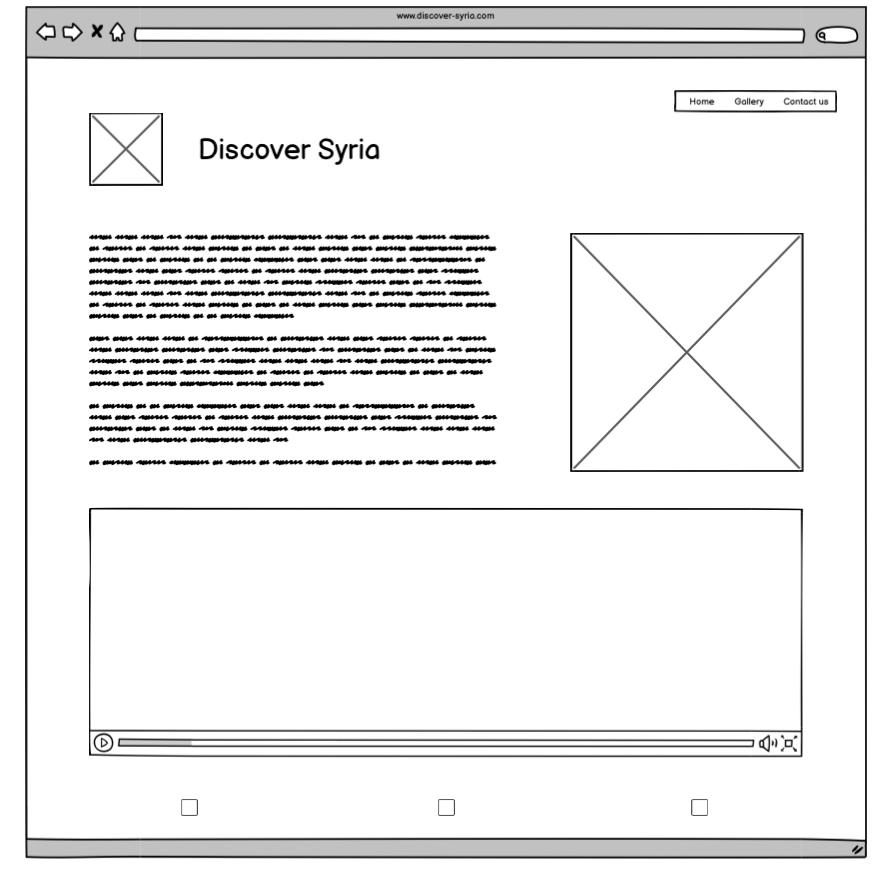

# Discover Syria

This is the static website about the country Syria, the home page talks about Syria and it's history, the website has a gallery page with different pictures about Syria and a contact form page. It is designed to be responsive on all devices so tourist can explore about the country from any device.

---

## CONTENTS

- [Discover Syria](#discover-syria)
  - [CONTENTS](#contents)
  - [Target Audience](#target-audience)
  - [User Stories](#user-stories)
    - [As a Traveler](#as-a-traveler)
    - [Contacting and Inquiry](#contacting-and-inquiry)
    - [Optimized User-Friendliness](#optimized-user-friendliness)
  - [Design](#design)
    - [Colour Scheme](#colour-scheme)
    - [Typography](#typography)
    - [Wireframes](#wireframes)
    - [Home](#home)
    - [Gallery](#gallery)
    - [Contact us](#contact-us)
    - [Mobile view](#mobile-view)
  - [Features](#features)
    - [General features on each page](#general-features-on-each-page)
    - [Navbar](#navbar)
    - [Footer with social media icons](#footer-with-social-media-icons)
  - [Features by page](#features-by-page)
    - [Landing page](#landing-page)
    - [Gallery Page](#gallery-page)
    - [Contact us page](#contact-us-page)
    - [Future Implementations](#future-implementations)
    - [Accessibility](#accessibility)
  - [Technologies Utilized](#technologies-utilized)
    - [Languages Used](#languages-used)
    - [Frameworks, Libraries \& Programs Used](#frameworks-libraries--programs-used)
  - [Deployment \& Local Development](#deployment--local-development)
    - [Deployment](#deployment)
    - [Local Development](#local-development)
      - [How to Clone](#how-to-clone)
  - [Testing](#testing)
  - [Manual Testing](#manual-testing)
    - [W3C Validator](#w3c-validator)
    - [Lighthouse](#lighthouse)
    - [Index page](#index-page)
    - [Gallery page](#gallery-page-1)
    - [Contact page](#contact-page)
    - [Full Testing](#full-testing)
  - [Credits](#credits)
    - [Code Used](#code-used)
    - [Content](#content)
    - [ Media](#media)
    - [Acknowledgments](#acknowledgments)

## Target Audience

The "Discover Syria" website is for all kinds of travelers and anyone interested in Syria. Whether you're a tourist, history enthusiast, culture lover, or foodie, our platform is your guide to Syria. It's open to families, solo travelers, professionals, students, researchers, and anyone with an open heart and mind. "Discover Syria" offers information, itineraries, and travel resources to make your trip educational and culturally immersive.

## User Stories

"Discover Syria" website is committed to providing a user-friendly experience for a wide range of visitors, from first-time explorers to returning enthusiasts. These are the primary user experience goals:

### As a Traveler

I aim to gain a deep understanding of what Syria has to offer. My carefully curated content and imagery provide a comprehensive view of the country's attractions, historical sites, and cultural richness.

### Contacting and Inquiry

I prioritize making it simple for you to get in touch with us. my "Contact Us" page features a user-friendly contact form and all the necessary contact details. Whether you have inquiries, need assistance, or seek additional information, my platform is designed to facilitate effortless communication.

### Optimized User-Friendliness

I've ensured a consistently enjoyable experience on all devices. My responsive design, incorporating media queries and flexible layouts, ensures that the website adapts seamlessly to various screen sizes, making it easy to access and interact with "Discover Syria" on desktops, tablets, and mobile devices.

## Design

### Colour Scheme

 

The color scheme of #000000 (black), #FFFFFF (white), and #C4C4C4 (light gray) was meticulously selected to convey a specific ambiance and enhance the user experience on our "Discover Syria" website. Black signifies sophistication and timelessness, lending a touch of elegance to our design. White symbolizes purity and clarity, creating a clean and uncluttered backdrop that facilitates easy reading and navigation. Light gray, represented by #C4C4C4, serves as a subtle accent color, enhancing readability and providing a gentle contrast. This minimalistic and balanced combination was chosen to offer a sense of professionalism, ensuring that our content remains the focal point, while also providing a comfortable and visually pleasing environment for our users as they explore Syria's diverse attractions and culture.

### Typography

We've selected the Libre Baskerville font for its clean, modern, and approachable look. It brings a sense of timeless elegance to our "Discover Syria" website while ensuring a pleasant reading experience for our visitors.

 

### Wireframes

### Home

 

### Gallery

 

### Contact us

 

### Mobile view

 

Balsamiq was used to design the wireframes

## Features

### General features on each page

### Navbar

I have coded my Navbar in html and css, and used the guide of Love running project to make it responive on mobile phones.

Desktop version nav bar with menu

Mobile version nav bar hamburger menu

### Footer with social media icons

I added three social media icons for instagram, facebook and twitter.

## Features by page

### Landing page

On the landing page, you'll dive into the vibrant culture and breathtaking landscapes of Syria through a quick intro. I added a visual map for context and a captivating video that truly captures Syria's essence.

### Gallery Page

The Gallery page highlights various tourism destinations in Syria, focusing on clean aesthetics and a welcoming atmosphere. It offers a glimpse into these locations and the positive vibes they exude. With responsive design, it adapts to various screen sizes, ensuring an enjoyable viewing experience. Get a preview of what's in store at these remarkable destinations in Syria.

### Contact us page

The Contact Us page provides a distinctive experience. It hosts a contact form against a looping video backdrop showcasing Syria's beauty. Additionally, the contact button features a hover animation for an engaging touch.

### Future Implementations

I want to add more content to the website to make it more informative, and make it fast too. I also want to add an option to book a tour through the website for the tourist.

### Accessibility

All images have alt text for better experience for the page reader,I also add clear aria-labels to make it easier too.

## Technologies Utilized

I harnessed a variety of technologies to craft and fine-tune this project:

**GitHub** It served as the repository for my site and the platform for online publication.

**Codeanywhere** This was my chosen Integrated Development Environment (IDE) for editing the site and implementing changes.

**Python** I employed Python 3 through the terminal to preview the site using a local HTTP server.

**HTML5** The foundation of my site is built on HTML version 5.

**CSS** CSS was instrumental in shaping the website's aesthetics, defining fonts, and structuring the layout.

**Google Maps** Embedded Google Maps enriched the site with location-related information.

**YouTube** I incorporated YouTube videos to enhance the site's multimedia content.

**Font Awesome** To integrate eye-catching social media icons, I turned to Font Awesome.

**Google Chrome** The website's development and testing primarily took place in the Google Chrome browser.

**Cloud convert** This resource came in handy for converting images, optimizing load times.

### Languages Used

HTML, CSS

### Frameworks, Libraries & Programs Used

**Chrome Devtool** - for the responsiveness of the website despite having to add a media query for different breakpoints so that the site looked better on mobile and tablets and on bigger screens.
**Github** - I stored my website on GitHub and used Gitpages to publish it.

## Deployment & Local Development

### Deployment

I deployed my website using github.

### Local Development

#### How to Clone

Here's how I made it happen:

1. I logged into my GitHub account.
2. Navigated to the repository of my project at /adrianskelton/Projecto1/.
3. I located the code button and copied the clone link that suited my needs.
4. With my code editor up and running, I opened the terminal.
5. I then set the current working directory to the location where I intended to place the cloned directory.
6. Into the terminal, I typed 'git clone' and pasted the link copied in step 3.
7. Finally, I pressed Enter to initiate the cloning process.

## Testing

## Manual Testing

### W3C Validator

[W3C](https://validator.w3.org/) was used to validate the HTML on all pages of the website. It was also used to validate the CSS.

 - Pass
 - Pass

### Lighthouse

I relied on Chrome's Lighthouse developer tool to assess my site's performance. Initially, the site suffered from lag due to large image files. However, after applying compression, the results improved significantly. Here are the final outcomes of this optimization effort.

### Index page

### Gallery page

### Contact page

### Full Testing

Full testing was performed on the following devices:

- Laptop:
  - Macbook Pro M1
- Mobile Devices:
  - Samsung Fold
  - Iphone 12
Each device tested the site using the following browsers:
- Google Chrome
- Safari

Additional testing was taken by friends on a variety of devices and screen sizes.

| Feature | Expected Outcome | Testing Performed | Result | Pass/Fail |
| --- | --- | --- | --- | --- |
| `Navbar` |
|  |  |  |  |  |
| Discover Syria Logo & Title | When clicked the user will be redirected to the home page. | Clicked Logo and title | Redirected to the home page. | Pass |
| Home Page Link | When clicked the user will be redirected to the home page.| Clicked link | Redirected to the home page. | Pass |
| Gallery Link | When clicked the user will be redirected to the gallery page. | Clicked link | Redirected to the gallery page. | Pass |
| Contact us Link | When clicked the user will be redirected to the Contact us page. | Clicked link | Redirected to the contact us page | Pass |
| --- | --- | --- | --- | --- |
| `Footer` |
|  |  |  |  |  |
| Social Icons | When clicked the user will be redirected to the appropriate social media pages in a new window. | Clicked icon | Redirected to the social media page in a new window. | Pass |
| --- | --- | --- | --- | --- |
| `Home Page` |
|   |   |   |   |
| Youtube video | Video does not autoplay only when clicked does it play. | Clicked video  | Video plays | Pass |
| --- | --- | --- | --- | --- |
| --- | --- | --- | --- | --- |
| `Contact Page` |
|   |   |   |   |
| Google Map | Map should be interactive when clicked on | Clicked on map | Map zoomed in and reacted as expected | Pass |
| Contact form | When items were left out the was a message asking to fill the section in| Clicked submit while leaving form unfillled | Form requested sections to be filled in | Pass |

 - - -

## Credits

### Code Used

Some of the love running project codes, such as the menu for phones.

### Content
I wrote the content about syria on the home page and used chat gpt to correct it.

###  Media

All images were taken from google images.

Home page video was also taken from youtube: <https://www.youtube.com/watch?v=fCyIKy-e0oU&embeds_referring_euri=https%3A%2F%2Fbashmdz.github.io%2F&source_ve_path=MjM4NTE&feature=emb_title>

favicon:

<https://www.flaticon.com/free-icons/syria>

Logo:
<https://seeklogo.com/vector-logo/311698/flag-map-of-syria>

### Acknowledgments
I want to extend my gratitude to my mentor, Luke, whose guidance and support were invaluable throughout this project. Additionally, I'd like to express my appreciation to the welcoming and helpful Slack community, where I received valuable insights, feedback, and code reviews. Your contributions have played a significant role in making this project a success.